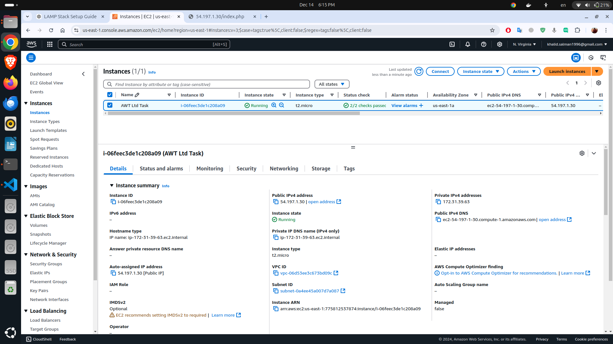
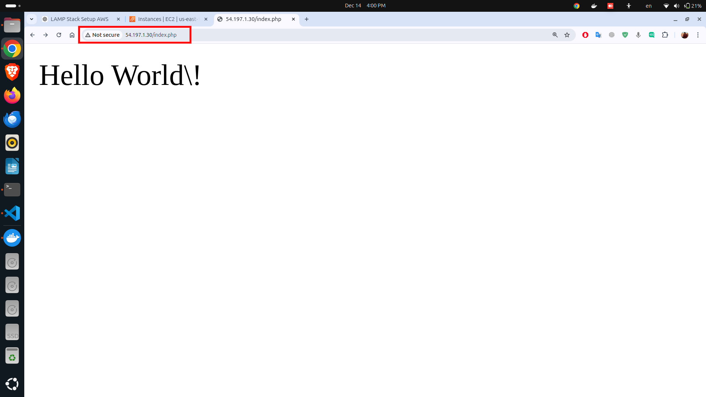
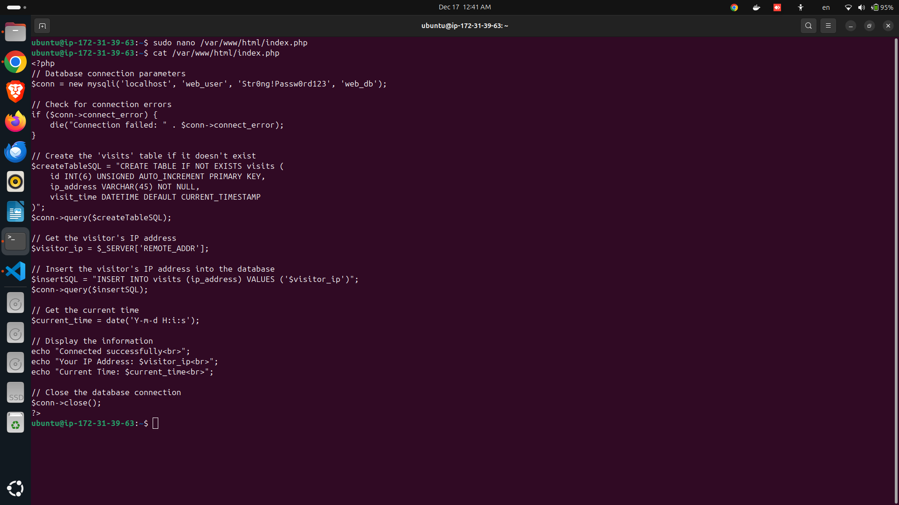
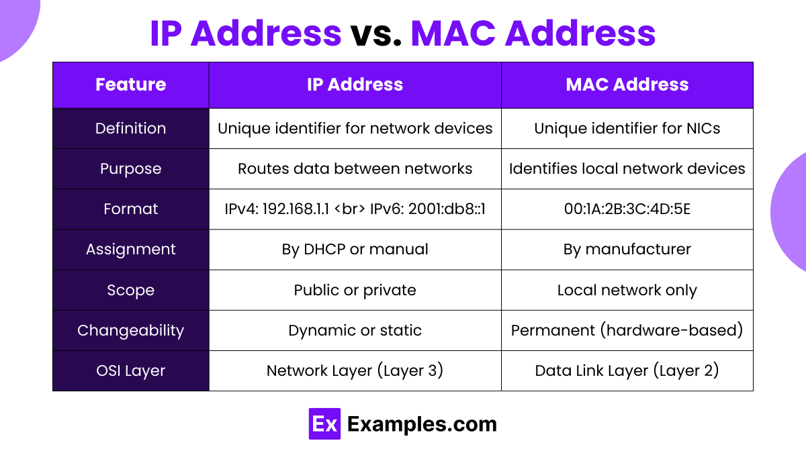

# LAMP Stack Setup on AWS

## Step 1: Set Up a Linux Instance on AWS

### Launch an EC2 Instance
1. Log in to your AWS account and navigate to the **EC2 Dashboard**.
2. Click **Launch Instance**.

3. Choose an **Ubuntu (or any Debian-based Linux) AMI**.

4. Select an instance type (e.g., `t2.micro` for free tier eligibility).

5. Configure security groups to allow inbound traffic:
   - HTTP (Port 80)
   - HTTPS (Port 443) *(Optional)*
   - SSH (Port 22) for remote access.
6. Launch the instance and download the key pair for SSH access.


### Method 2: Launch an EC2 Instance via AWS CLI Script

#### Bash Script
```bash
#!/bin/bash

# Set variables
KEY_NAME="my-key-pair" # Change this to your desired key pair name
SECURITY_GROUP_NAME="my-security-group"
INSTANCE_TYPE="t2.micro"
AMI_ID="ami-0dba2cb6798deb6d8" # Replace with the latest Ubuntu AMI ID for your region
REGION="us-east-1" # Change to your desired AWS region

# Step 1: Create a key pair and save the private key
if [ ! -f "$KEY_NAME.pem" ]; then
  echo "Creating a new key pair..."
  aws ec2 create-key-pair \
    --key-name "$KEY_NAME" \
    --query "KeyMaterial" \
    --output text > "$KEY_NAME.pem"
  chmod 400 "$KEY_NAME.pem"
else
  echo "Key pair already exists. Skipping creation."
fi

# Step 2: Create a security group
SECURITY_GROUP_ID=$(aws ec2 create-security-group \
  --group-name "$SECURITY_GROUP_NAME" \
  --description "Security group for EC2 instance" \
  --query 'GroupId' \
  --output text)

# Add rules to allow SSH, HTTP, and HTTPS traffic
aws ec2 authorize-security-group-ingress \
  --group-id "$SECURITY_GROUP_ID" \
  --protocol tcp --port 22 --cidr 0.0.0.0/0
aws ec2 authorize-security-group-ingress \
  --group-id "$SECURITY_GROUP_ID" \
  --protocol tcp --port 80 --cidr 0.0.0.0/0
aws ec2 authorize-security-group-ingress \
  --group-id "$SECURITY_GROUP_ID" \
  --protocol tcp --port 443 --cidr 0.0.0.0/0

# Step 3: Launch the EC2 instance
INSTANCE_ID=$(aws ec2 run-instances \
  --image-id "$AMI_ID" \
  --count 1 \
  --instance-type "$INSTANCE_TYPE" \
  --key-name "$KEY_NAME" \
  --security-group-ids "$SECURITY_GROUP_ID" \
  --query 'Instances[0].InstanceId' \
  --output text)

# Wait until the instance is running
echo "Waiting for the instance to be in 'running' state..."
aws ec2 wait instance-running --instance-ids "$INSTANCE_ID"

# Get the public IP address of the instance
PUBLIC_IP=$(aws ec2 describe-instances \
  --instance-ids "$INSTANCE_ID" \
  --query 'Reservations[0].Instances[0].PublicIpAddress' \
  --output text)

echo "Instance launched successfully!"
echo "Instance ID: $INSTANCE_ID"
echo "Public IP: $PUBLIC_IP"

# Step 4: Connect to the instance via SSH
echo "Connecting to the instance via SSH..."
ssh -i "$KEY_NAME.pem" ubuntu@$PUBLIC_IP
```


#### How to Use
1. Save the script above as `launch-ec2-instance.sh`.
2. Make it executable:
   ```bash
   chmod +x launch-ec2-instance.sh
   ```
3. Run the script:
   ```bash
   ./launch-ec2-instance.sh
   ```


Instance launched


---


### Connect to the Instance
Use an SSH client to connect to the instance:
```bash
ssh -i your-key.pem ubuntu@<instance-public-ip>
```
Replace `<instance-public-ip>` with the public IP address of your instance.

Replace `your-key.pem` with the path to your private key file.


---

## Step 2: Install LAMP Stack

### Update System Packages
```bash
sudo apt-get update
```


### Install Apache, MySQL, and PHP
```bash
sudo apt-get install apache2 mysql-server php libapache2-mod-php php-mysql -y
```


### Test Apache
Create a test HTML file:
```bash
echo "Hello, World!" | sudo tee /var/www/html/index.html
```
Access `http://<instance-public-ip>/` in a browser to verify Apache is working.


open in browser


### Replace HTML with PHP
Create a PHP file:
```bash
echo "<?php echo 'Hello World!'; ?>" | sudo tee /var/www/html/index.php
```
Access `http://<instance-public-ip>/index.php` to verify PHP is working.



### Secure MySQL
Run the secure installation script:
```bash
sudo mysql_secure_installation
```
Follow the prompts to secure the installation.


### Set Up a Database and User
Log in to MySQL:
```bash
sudo mysql -u root -p
```
Run the following SQL commands:
```sql
CREATE DATABASE web_db;
CREATE USER 'web_user'@'localhost' IDENTIFIED BY 'StrongPassword123';
GRANT ALL PRIVILEGES ON web_db.* TO 'web_user'@'localhost';
FLUSH PRIVILEGES;
EXIT;
```


## Step 3: Update PHP File to Use Database
Edit `/var/www/html/index.php` to connect to MySQL:
```php
<?php
// Database connection parameters
$conn = new mysqli('localhost', 'web_user', 'Str0ng!Passw0rd123', 'web_db');

// Check for connection errors
if ($conn->connect_error) {
    die("Connection failed: " . $conn->connect_error);
}

// Create the 'visits' table if it doesn't exist
$createTableSQL = "CREATE TABLE IF NOT EXISTS visits (
    id INT(6) UNSIGNED AUTO_INCREMENT PRIMARY KEY,
    ip_address VARCHAR(45) NOT NULL,
    visit_time DATETIME DEFAULT CURRENT_TIMESTAMP
)";
$conn->query($createTableSQL);

// Get the visitor's IP address
$visitor_ip = $_SERVER['REMOTE_ADDR'];

// Insert the visitor's IP address into the database
$insertSQL = "INSERT INTO visits (ip_address) VALUES ('$visitor_ip')";
$conn->query($insertSQL);

// Get the current time
$current_time = date('Y-m-d H:i:s');

// Display the information
echo "Connected successfully<br>";
echo "Your IP Address: $visitor_ip<br>";
echo "Current Time: $current_time<br>";

// Close the database connection
$conn->close();
?>
```


confirm php edit 



Test the page again: `http://<instance-public-ip>/index.php`.


  **Verify Database Entries:**
  ```sql
   USE web_db;
   SELECT * FROM visits;
  ```

   


## Step 4: Make the Website Publicly Accessible
1. Confirm that your security group allows HTTP traffic.
2. Ensure the public IP or domain points correctly to the instance.
3. Optionally, use AWS Route 53 for domain configuration.


allows HTTP traffic.


## Step 5: Initialize Git and Push Code

### Set Up Git
Install Git:
```bash
sudo apt-get install git
```


Initialize a Git repository:
```bash
git init
```


### Create `.gitignore`
Add sensitive files to exclude:
```bash
echo ".env" > .gitignore
```


### Add `README.md`
Document the setup:
1. Steps to install and configure LAMP.
2. Steps to make the site accessible publicly.
3. Explanations of IP, MAC addresses, switches, routers, routing protocols, and SSH connection.


---

## Networking Basics

### 1. IP Address
An **IP Address** (Internet Protocol Address) is a unique identifier assigned to devices on a network. It serves two main purposes:
- **Identification**: Identifies a device on a network.
- **Location Addressing**: Provides the location of the device in the network.


IP Classes


IP addresses come in two versions:
- **IPv4**: Uses 32-bit addresses (e.g., 192.168.1.1).
- **IPv6**: Uses 128-bit addresses to accommodate more devices.


### 2. MAC Address
A **MAC Address** (Media Access Control Address) is a unique hardware identifier assigned to a device’s network interface card (NIC). It is used for:
- Communication within a local network (LAN).
- Ensuring data packets reach the correct hardware device.


**Difference Between IP and MAC Addresses:**
- **IP Address**: Logical address that can change based on the network.
- **MAC Address**: Physical address tied to the hardware and does not change.




### 3. Switches, Routers, and Routing Protocols
- **Switch**: A network device that connects devices within a LAN and uses MAC addresses to forward data to the correct device.
- **Router**: A device that connects multiple networks and directs data between them using IP addresses.


- **Routing Protocols**: Algorithms that determine the best path for data to travel across a network (e.g., OSPF, BGP, RIP).


### 4. Remote Connection to Cloud Instance
To connect to a cloud-based Linux instance:
1. Ensure the security group allows SSH traffic (port 22).
2. Obtain the public IP address of the instance.


3. Use an SSH client (e.g., OpenSSH, PuTTY):
   ```bash
   ssh -i your-key.pem ubuntu@<instance-public-ip>
   ```
4. For additional security, you can configure key-based authentication and disable password-based logins.


### Commit and Push
```bash
git add .
git commit -m "Initial commit: Add documentation and website"
git remote add origin <your-github-repo-url>
git push -u origin main
```


push to master 


### Live Demo

Visit the live demo at [http://54.197.1.30/index.php](http://54.197.1.30/index.php).